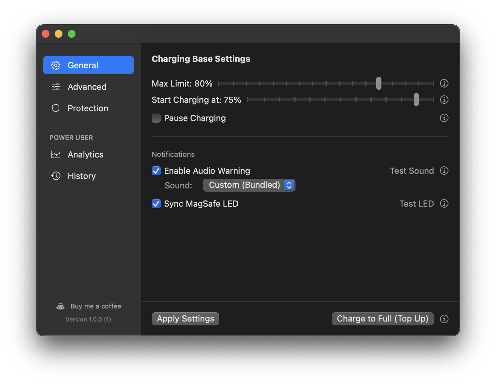
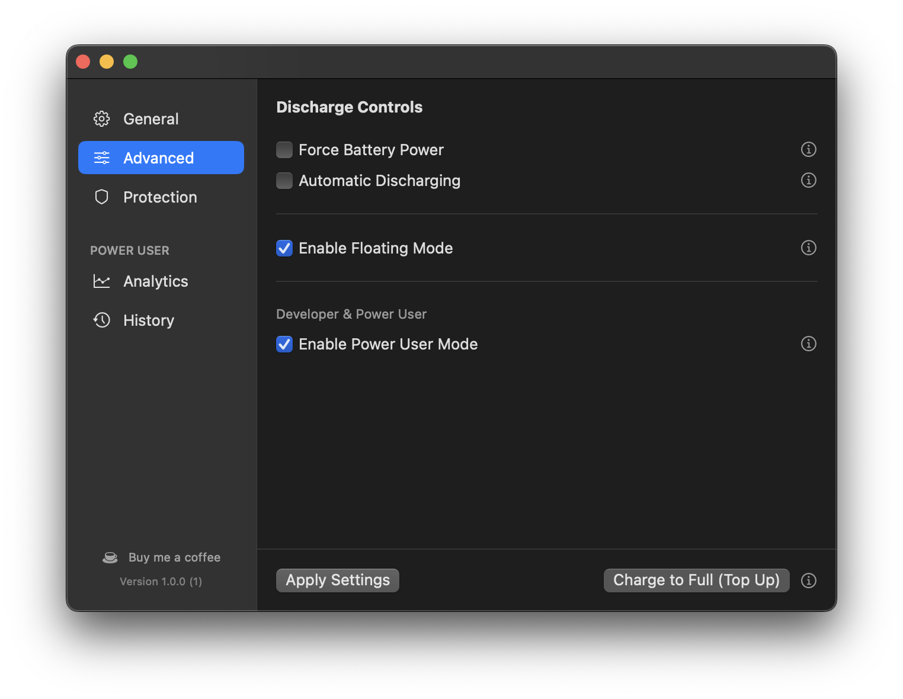
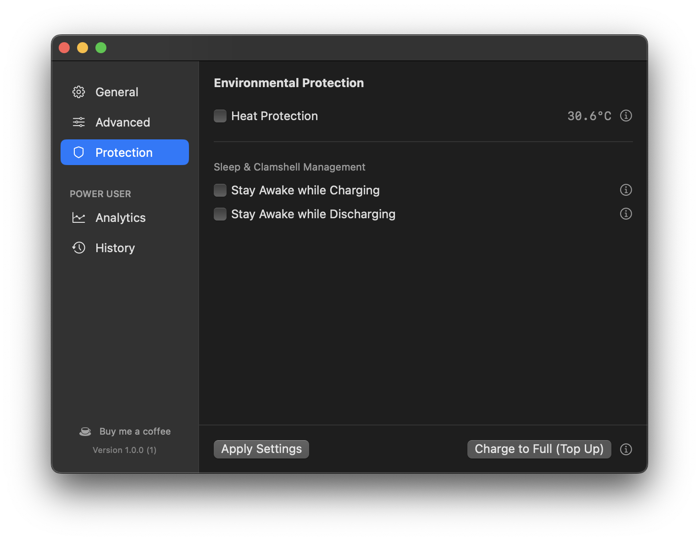
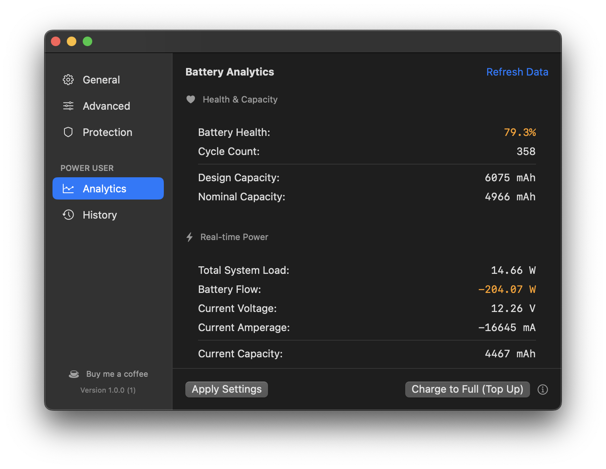
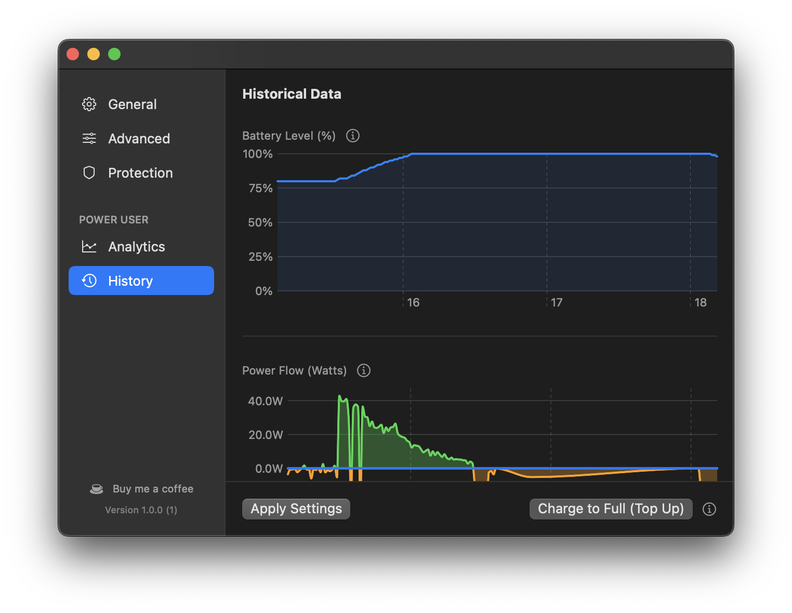
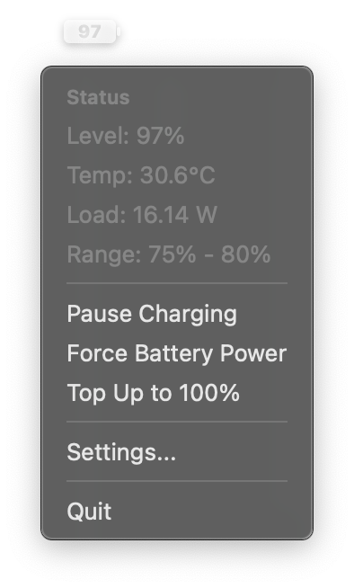
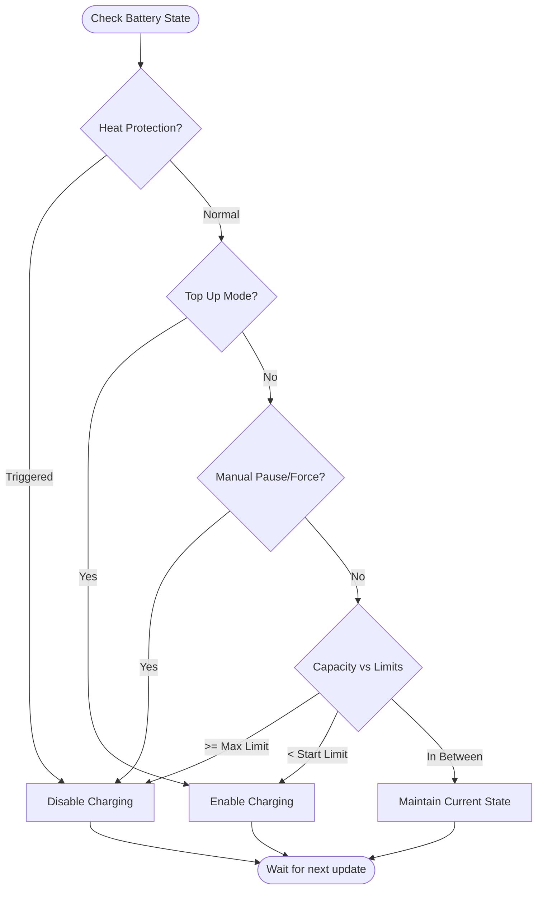

# ChargeControl

A powerful, user-centric tool for managing battery health and power states on Apple Silicon Macs. ChargeControl allows you to set custom charging limits, manually discharge your battery while plugged in, and receive audio warnings when charging starts.

Unlike standard macOS battery management, ChargeControl gives you direct control over the System Management Controller (SMC) to enforce your preferences using a professional **Absolute Threshold** approach.

---

## 📸 Screenshots

| General | Advanced | Protection |
|---------|----------|------------|
|  |  |  |

| Analytics | History | Menu Bar |
|-----------|---------|----------|
|  |  |  |

---

## ✨ Features

- **Custom Charge Limiting:** Set a maximum charge percentage (50%–100%) to reduce battery wear.
- **Smart Hysteresis:** Avoids "micro-cycling" by waiting for the battery to drop below a specific floor before resuming charge.
- **Lower Limit Re-engagement:** Define a "Start Charging at" floor to manage the re-engagement gap. Your Mac will stay on AC power but won't charge the battery until it naturally drops below this limit.
- **Active Floating Mode:** Once the Max Limit is reached, your Mac will actively disconnect the power adapter virtually to let the battery "float" down to the Start Limit, then charge back up. This keeps the battery in constant motion rather than staying idle at a high voltage.
- **Pause Charging:** Manually stop the charging process. Your Mac will continue to run from the power adapter without charging the battery.
- **Forced Battery Power:** Virtually disconnect the power adapter to run entirely on battery. Useful for reducing charge level without physically unplugging.
- **Automatic Discharging:** Automatically switch to battery power if your charge is above the set limit, then reconnect AC once the limit is reached.
- **Top Up Mode:** Easily override limits to charge to 100% with a single click. Perfect for travel preparation.
- **Audio Warnings:** Configurable sound notification when the system starts charging. Choose from a custom bundled sound or any macOS system alert (Ping, Hero, Basso, and more).
- **Heat Protection:** Automatically pauses charging if the battery temperature exceeds a user-defined threshold.
- **Sleep & Clamshell Management:** Stay awake during critical charging or discharging tasks, ensuring limits are respected in Clamshell Mode.
- **MagSafe LED Sync:** Automatically changes the MagSafe connector color based on charging state (Orange = Charging, Green = Limit Reached, Off = Discharging).
- **Historical Charts:** View 60-second telemetry data (Battery Level, Power Flow) in the **History** tab (Requires Power User Mode).
- **Automation CLI:** Control and monitor everything from the terminal using the included `cc` tool.
- **Power User Analytics:** Detailed hardware telemetry including Voltage, Amperage, Cycle Count, and multiple thermal sensors.

---

## 📋 Prerequisites

- **Hardware:** Apple Silicon Mac (M1, M2, M3, M4, or later).
- **Operating System:** macOS 13.0 (Ventura) or later.
- **Development:** Swift 5.9+ (included with Xcode).

---

## 🛠️ Installation & Setup

### 1. Build from Source

1. Clone the repository:
   ```bash
   git clone https://github.com/will2022/ChargeControl.git
   cd ChargeControl/ChargeControl
   ```
2. Run the build script:
   ```bash
   ./build.sh
   ```
   The built application will be located at `build/ChargeControl.app`.

### 2. Install to Applications

For the background daemon to work reliably with macOS security policies (`SMAppService`), it is recommended to move the app to your `/Applications` folder:

```bash
cp -R build/ChargeControl.app /Applications/
```

### 3. Install the CLI (Optional)

To use the CLI from anywhere, symlink the binary to your path:
```bash
sudo ln -s /Applications/ChargeControl.app/Contents/MacOS/cc /usr/local/bin/cc
```

### 4. First Run & Permissions

1. Open `ChargeControl.app` from your `/Applications` folder.
2. The app will attempt to register its privileged helper tool (`ChargeControlDaemon`).
3. **Password Prompt:** macOS will prompt you for your administrator password to authorize the background service.

---

## 📖 Usage

- **General Tab:** Manage your Max/Start limits and MagSafe/Audio notifications.
- **Advanced Tab:** Control manual and automatic discharge behaviors, including **Floating Mode** and **Power User Mode**.
- **Protection Tab:** Configure Heat Protection and Sleep/Clamshell inhibition settings.
- **Analytics & History:** View real-time telemetry and historical performance charts (Unlocks via Power User Mode).
- **Override Warnings:** Look for the yellow banner in Settings if a high-priority feature (like Heat Protection or Top Up Mode) is currently overriding your limits.

---

## 💻 CLI Usage

The `cc` tool allows for powerful automation and scripting:

```bash
cc status      # Show current battery and daemon status
cc pause       # Manually pause charging
cc resume      # Revert to automatic charging limits (enforce Start/Max)
cc force       # Force battery power (virtual adapter disconnect)
cc unforce     # Re-enable power adapter
cc topup       # Start Top Up to 100%
cc limit 80    # Set the Max Charge Limit to 80%
```

---

## 🔍 Troubleshooting

### Daemon Not Responding
If settings aren't applying or the UI isn't updating:
1. Ensure the app is in `/Applications`.
2. Restart the daemon manually:
   ```bash
   sudo killall ChargeControlDaemon
   ```
3. Re-open the app.

### Logs
You can monitor the app's behavior by checking the logs:
- **App Logs:** `ChargeControl/app.log` (in the project folder).
- **System Logs:**
  ```bash
  log show --predicate 'subsystem == "com.chargecontrol.daemon"' --last 5m
  ```

---

## 🛠️ Technical Details

### Charging Logic Flow
ChargeControl uses an **Absolute Threshold** approach with a state-based monitor.



### SMC Keys (Apple Silicon)
ChargeControl interacts with the AppleSMC using the following keys:
- `CH0C` / `CHTE`: Charging control (0 = Enable, 1 = Disable).
- `CHIE` / `CH0J`: Power adapter isolation (0 = Connected, 8/32 = Isolated).
- `ACLC`: MagSafe LED control (0 = System, 1 = Off, 3 = Green, 4 = Orange).
- `B0Te`, `TC0P`, `TG0P`, `Ts0P`: Thermal sensors (Battery, CPU, GPU, Palm Rest).
- `B0AC`, `B0AV`: Real-time Amperage and Voltage.
- `B0CT`, `B0FC`, `B0DC`: Cycle Count, Full Capacity, and Design Capacity.

ChargeControl writes directly to the SMC charging control keys to enforce limits. State changes take effect immediately through macOS's power management subsystem.

---

## 🚀 Roadmap

### 🔋 Charging Management
- [x] **Custom Charge Limiting**
- [x] **Lower Limit Re-engagement:** Define a floor below which charging will not restart. (Absolute Threshold).
- [x] **Active Floating Mode:** Actively disconnect adapter to force discharge between limits.
- [x] **Top Up Mode:** Easily override limits to charge to 100% with a single click.

### 🔌 Discharge & Adapter Control
- [x] **Forced Battery Power:** Forces the MacBook to run on battery even when plugged in.
- [x] **Automatic Discharging:** Drain battery to the set limit if currently above it.
- [x] **Virtual Adapter Toggle**

### 🛡️ Protection & Safety
- [x] **Heat Protection:** Automatically pauses charging if battery temperature exceeds a threshold.
- [x] **Sleep & Clamshell Management:** Respect limits even in Clamshell Mode and during active charging.
- [ ] **Pause Background Activity:** Reduce system load during critical charging.

### 🛠️ Maintenance
- [ ] **Calibration Mode:** Automated 100% -> 10% -> 100% cycle to sync the fuel gauge.
- [ ] **Scheduling:** Recurring maintenance tasks (weekly/monthly).

### 🖥️ System Integration
- [x] **MagSafe LED Synchronization:** Reflect software state on the MagSafe connector light.
- [x] **Automation & Scripting:** Standalone `cc` CLI tool for terminal control.

### 📊 Analytics & Insights
- [x] **Power Flow Dashboard:** Real-time visualization of energy distribution between the power adapter, the battery, and the system components.
- [x] **Advanced Battery Stats:** Displays detailed health metrics including cycle count, original design capacity, current maximum capacity, and precise temperature readings from internal sensors.
- [x] **Historical Data:** Persistent SQLite logging and SwiftUI Charts.

---

## ☕ Support the Project

If ChargeControl helps you keep your battery healthy, consider supporting its development:

[Buy me a coffee](https://ko-fi.com/will2022)

---

## ⚖️ License

[BSD-3-Clause](LICENSE)
